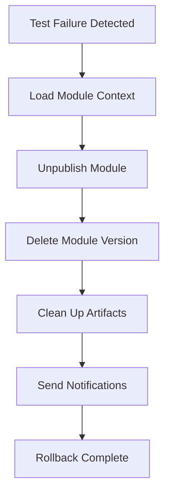

# Harness Module Registry Pipeline with Automated Testing and Rollback

This repository contains two comprehensive Harness pipeline implementations for creating modules in the Harness Module Registry, running validation tests, and automatically rolling back registry changes if tests fail.

## 📋 Overview

Both pipelines implement a robust workflow:
1. **Create/Prepare Module** - Package and validate the module
2. **Register Module** - Create entry in Harness Module Registry
3. **Run Tests** - Execute comprehensive testing pipelines
4. **Rollback on Failure** - Automatically remove module from registry if tests fail

## 🏗️ Pipeline Options

### Option 1: Basic Module Registry Pipeline
**File:** `harness-module-registry-pipeline.yaml`

A straightforward implementation suitable for:
- Quick module registration
- Integration with existing test pipelines
- Generic module types (Terraform, Helm, scripts, etc.)

**Key Features:**
- Shell-script based module creation
- External testing pipeline integration
- HTTP API-based rollback
- Notification system integration

### Option 2: IACM Advanced Pipeline
**File:** `harness-iacm-module-registry-advanced.yaml`

A comprehensive IACM-focused implementation with:
- Full CI/CD integration with codebase cloning
- Built-in Terraform validation and security scanning
- IACM workspace creation for testing
- Advanced compatibility testing
- Native Terraform plugin integration

## 🚀 Quick Start

### Prerequisites

1. **Harness Account Setup:**
   - Organization and Project created
   - API key with module registry permissions
   - CI/CD infrastructure configured

2. **Required Secrets:**
   ```yaml
   harness_api_key: Your Harness API key with module registry access
   ```

3. **Connector Requirements:**
   - Git connector for source code (IACM pipeline)
   - Docker connector for container execution
   - Cloud provider connector for IACM workspace

### Basic Pipeline Setup

1. **Import the pipeline:**
   ```bash
   # Option 1: Via Harness UI
   # Navigate to Pipelines > Create Pipeline > Import from YAML
   # Upload: harness-module-registry-pipeline.yaml
   
   # Option 2: Via API
   curl -X POST \
     'https://app.harness.io/gateway/pipeline/api/pipelines/v2?accountIdentifier=<account>&orgIdentifier=<org>&projectIdentifier=<project>' \
     -H 'x-api-key: <your-api-key>' \
     -H 'Content-Type: application/yaml' \
     --data-binary @harness-module-registry-pipeline.yaml
   ```

2. **Configure required variables:**
   - `moduleName`: Name of your module
   - `moduleVersion`: Semantic version (e.g., 1.0.0)
   - `moduleSource`: Git repository URL
   - `testingPipelineId`: ID of your testing pipeline
   - `registryUrl`: Harness IACM API endpoint

3. **Run the pipeline:**
   ```bash
   # Trigger via UI or API
   curl -X POST \
     'https://app.harness.io/gateway/pipeline/api/pipeline/execute/<pipeline-id>?accountIdentifier=<account>' \
     -H 'x-api-key: <your-api-key>' \
     -H 'Content-Type: application/json' \
     -d '{
       "runtimeInputYaml": "variables:\n  moduleName: my-terraform-module\n  moduleVersion: 1.0.0"
     }'
   ```

### IACM Pipeline Setup

1. **Configure codebase:**
   ```yaml
   properties:
     ci:
       codebase:
         connectorRef: <your-git-connector>
         repoName: <your-repo-name>
         build:
           type: branch
           spec:
             branch: main
   ```

2. **Customize test inputs:**
   ```yaml
   testModuleInputs: |
     region = "us-east-1"
     environment = "test"
     instance_type = "t3.micro"
   ```

3. **Run the pipeline** with the configured parameters

## 📊 Pipeline Stages Breakdown

### Stage 1: Module Preparation/Creation

**Basic Pipeline:**
```yaml
- Validates module metadata
- Creates registry entry via API
- Publishes artifacts
- Stores context for rollback
```

**IACM Pipeline:**
```yaml
- Clones codebase
- Validates Terraform structure
- Runs security scan (Checkov)
- Packages module with versioning
```

### Stage 2: Module Registration

**Basic Pipeline:**
```yaml
- HTTP POST to create module
- Artifact upload
- Module publishing
```

**IACM Pipeline:**
```yaml
- HTTP API registration
- Artifact upload via curl
- Module status change to "published"
- Metadata tracking
```

### Stage 3: Testing

**Basic Pipeline:**
- Executes external testing pipeline
- Passes module ID and version
- Waits for completion

**IACM Pipeline:**
```yaml
- Creates ephemeral IACM workspace
- Initializes Terraform with new module
- Runs plan/apply/destroy cycle
- Executes integration tests
- Validates outputs
```

### Stage 4: Validation Tests (IACM Only)

```yaml
- Validates registry entry status
- Tests Terraform version compatibility
- Verifies module accessibility
```

### Stage 5: Rollback (On Failure)

**Triggers when:**
- Testing stage fails
- Validation tests fail
- Any critical error occurs

**Actions:**
```yaml
1. Load module context
2. Unpublish module (change status)
3. Delete module version from registry
4. Clean up artifacts
5. Send notifications
```

## 🔧 Configuration Options

### Required Variables

| Variable | Description | Example | Required |
|----------|-------------|---------|----------|
| `moduleName` | Module identifier | `aws-vpc-module` | Yes |
| `moduleVersion` | Semantic version | `1.0.0` | Yes |
| `moduleDescription` | Module description | `VPC module for AWS` | Yes |
| `moduleProvider` | Cloud provider | `aws` | IACM only |
| `registryUrl` | Registry API URL | `https://app.harness.io/gateway/iacm` | Yes |

### Optional Variables

| Variable | Description | Default |
|----------|-------------|---------|
| `moduleVisibility` | Access control | `private` |
| `modulePath` | Path in repo | `.` |
| `testModuleInputs` | Test variables | `""` |
| `customTestScript` | Custom tests | `echo 'No tests'` |
| `notificationWebhook` | Slack webhook | `""` |

## 🧪 Testing Strategy

### Built-in Tests (IACM Pipeline)

1. **Structure Validation:**
   - Terraform file presence check
   - `terraform validate`
   - Format checking

2. **Security Scanning:**
   - Checkov policy checks
   - JUnit XML output
   - Fail on critical issues

3. **Integration Testing:**
   - Real deployment to test workspace
   - Output validation
   - Custom test execution
   - Resource cleanup

4. **Compatibility Testing:**
   - Multiple Terraform versions
   - Provider compatibility
   - Module dependency checks

### External Testing (Basic Pipeline)

Create a separate testing pipeline that:
```yaml
pipeline:
  stages:
    - stage:
        name: Test Module
        variables:
          - name: module_name
            type: String
          - name: module_version
            type: String
        steps:
          - step:
              name: Run Tests
              # Your test logic here
```

## 🔄 Rollback Mechanism

### Automatic Rollback Triggers

The rollback stage executes when:
```yaml
when:
  pipelineStatus: Failure
  condition: |
    <+pipeline.stages.run_testing_pipeline.status> == "Failed" ||
    <+pipeline.stages.create_test_workspace.status> == "Failed" ||
    <+pipeline.stages.validation_tests.status> == "Failed"
```

### Rollback Process



### Manual Rollback

If automatic rollback fails:

```bash
# Using Harness API
MODULE_ID="<module-id>"
ACCOUNT_ID="<account-id>"
ORG_ID="<org-id>"
PROJECT_ID="<project-id>"
API_KEY="<your-api-key>"

# Unpublish
curl -X POST \
  "https://app.harness.io/gateway/iacm/v1/orgs/${ORG_ID}/projects/${PROJECT_ID}/modules/${MODULE_ID}/unpublish" \
  -H "x-api-key: ${API_KEY}"

# Delete
curl -X DELETE \
  "https://app.harness.io/gateway/iacm/v1/orgs/${ORG_ID}/projects/${PROJECT_ID}/modules/${MODULE_ID}" \
  -H "x-api-key: ${API_KEY}"
```

## 📧 Notifications

### Slack Integration

Configure webhook URL:
```yaml
variables:
  - name: slackWebhook
    value: https://hooks.slack.com/services/YOUR/WEBHOOK/URL
```

Notification includes:
- Module name and version
- Pipeline execution URL
- Rollback status
- Failure reason

### Email Notifications

Built-in email notifications:
```yaml
notificationRules:
  - name: Pipeline Failure Notification
    pipelineEvents:
      - type: PipelineFailed
    notificationMethod:
      type: Email
      spec:
        recipients:
          - <+pipeline.triggeredBy.email>
```

## 🛡️ Security Best Practices

1. **API Key Management:**
   ```yaml
   # Store in Harness secrets
   secrets.getValue('harness_api_key')
   ```

2. **Module Visibility:**
   - Use `private` for internal modules
   - Use `organization` for shared modules
   - Avoid `public` unless necessary

3. **Security Scanning:**
   - Enable Checkov in CI stage
   - Fail on critical/high severity issues
   - Review scan results regularly

4. **Access Control:**
   - Limit API key permissions
   - Use RBAC for pipeline execution
   - Audit module registry access

## 🐛 Troubleshooting

### Common Issues

**Issue: Module creation fails**
```bash
# Check API response
curl -X GET \
  "https://app.harness.io/gateway/iacm/v1/orgs/${ORG_ID}/projects/${PROJECT_ID}/modules" \
  -H "x-api-key: ${API_KEY}"
```

**Issue: Rollback doesn't execute**
- Verify `when` condition in rollback stage
- Check stage status expressions
- Review pipeline execution logs

**Issue: Tests timeout**
```yaml
# Increase timeout in test steps
timeout: 30m  # Adjust as needed
```

**Issue: Module context not found during rollback**
```bash
# Context file location
/tmp/module_registry_context.json

# Verify file creation in upload step
cat /tmp/module_registry_context.json
```

## 📚 Advanced Usage

### Multi-Environment Deployment

```yaml
# Create separate pipelines for each environment
- dev-module-registry
- staging-module-registry  
- prod-module-registry

# Use different registry visibility
dev: private
staging: organization
prod: organization
```

### Version Promotion

```yaml
# Promote successful modules
pipeline:
  stages:
    - stage:
        name: Promote to Production
        when:
          condition: <+pipeline.stages.validation_tests.status> == "Success"
        steps:
          - step:
              name: Copy to Prod Registry
              # Copy module to production registry
```

### Integration with GitOps

```yaml
# Trigger on Git events
trigger:
  name: Module Update Trigger
  identifier: module_update
  source:
    type: Webhook
    spec:
      type: Github
      spec:
        type: PullRequest
        spec:
          events:
            - Closed
          pathFilters:
            - modules/**/*.tf
```

## 📈 Monitoring and Metrics

### Key Metrics to Track

1. **Module Creation Success Rate**
2. **Test Pass/Fail Rate**
3. **Rollback Frequency**
4. **Average Pipeline Duration**
5. **Security Scan Results**

### Dashboard Queries

```sql
-- Module creation success rate (Harness Dashboard)
SELECT 
  COUNT(CASE WHEN status = 'SUCCESS' THEN 1 END) * 100.0 / COUNT(*) as success_rate
FROM pipeline_executions
WHERE pipeline_identifier = 'iacm_module_registry_advanced'
  AND created_at > NOW() - INTERVAL '30 days'
```

## 🤝 Contributing

To improve these pipelines:

1. Test changes in development environment
2. Update documentation
3. Add relevant examples
4. Submit changes for review

## 📄 License

These pipeline templates are provided as-is for use with Harness platform.

## 🔗 Resources

- [Harness Documentation](https://docs.harness.io)
- [Harness IACM Guide](https://docs.harness.io/docs/infrastructure-as-code-management)
- [Terraform Registry Docs](https://developer.hashicorp.com/terraform/registry)
- [Harness API Reference](https://apidocs.harness.io)

## 📞 Support

For issues or questions:
- Harness Support: support.harness.io
- Harness Community: community.harness.io
- Documentation: docs.harness.io

---

**Version:** 1.0.0  
**Last Updated:** 2025-11-17  
**Compatibility:** Harness SaaS, Harness Self-Managed Enterprise Edition
